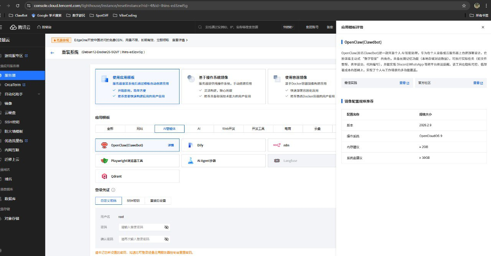

# 🦞 5 分钟快速获得你的专属 OpenClaw！手把手保姆级教程

> 🎉 本文将手把手教你如何免费白嫖腾讯云 VPS，并一键部署 OpenClaw！跟着下面的步骤走，5 分钟就能搞定！

---

## 📋 课前准备

- ✅ 一个微信账号
- ✅ 一台电脑

---

## 🚀 阶段一：领取免费 VPS

> 🔗 **详细教程**：https://cloud.tencent.com/developer/article/2621753

### 第一步：注册腾讯云 CodeBuddy

> 🔗 **活动链接**：
> * 邮箱注册（国际版）———— https://www.codebuddy.ai/promotion/?ref=chlw5oeiah
> * 微信登录（国内版）———— https://www.codebuddy.cn/promotion/?ref=7j6lct16z

**流程：**
1. 打开上方活动链接
2. 注册账号
3. 下载并安装 CodeBuddy 软件
4. 安装成功后，输入 `help` 激活

### 第二步：领取免费 VPS

**流程：**
1. 完成简单任务后，进入领取页面
2. 选择服务器节点：
   - 🇨🇳 **北京** - 适合北方用户
   - 🇨🇳 **上海** - 适合南方用户
   - 🇨🇳 **广州** - 适合华南用户
   - 🇸🇬 **新加坡** - 海外版需要选这个

> 📌 **海内外版区别**：
> - **国内版**：使用国内模型（推荐 MiniMax、Kimi）
> - **海外版**：使用国外模型（需要选新加坡节点）
> - 两个版本功能一样，看你需求选择！

> ⚠️ **提示**：CodeBuddy 活跃满 7 天，可再送 2 个月免费时长！不然默认 1 个月免费。

### 选做：完成贪吃蛇任务

这是为了熟悉部署流程，可做可不做～

---

## 🚀 阶段二：部署 OpenClaw

> 🔗 **详细教程**：https://cloud.tencent.com/developer/article/2626151

### 第三步：重置 VPS，安装 OpenClaw

1. 在腾讯云控制台找到你的 VPS
2. 重置系统镜像，选择 **OpenClaw 应用镜像**
3. ⚠️ **注意：一定要选最新版本的 OpenClaw 镜像，新版更好用！**
4. 等待安装完成

> 💡 根据上方教程链接操作即可，不需要自己手动配置！

### 第四步：接入飞书

> 🔗 **飞书接入教程**：https://cloud.tencent.com/developer/article/2626151

新版 OpenClaw 原生支持飞书接入，按教程走就行，非常简单！

---

## ⚠️ 重要避坑指南

### 坑1：API Key 决定 Agent 智商！
- ❌ 不要用免费的 API Key（不稳定、效果差）
- ✅ 推荐用 **MiniMax** 或 **Kimi**
- 💡 后续想换新的 Key，可以让你的 AI 助手帮你配！

### 坑2：记得备份重要文件！
- 💾 配置文件、记忆文件都要备份
- 📌 让 AI 助手帮你备份最省心！

---

## ❓ 常见问题

| 问题 | 解决方案 |
|------|----------|
| VPS 领了不会用？ | 在 CodeBuddy IDE 上查询实例，确认实例后远程修改 Debug！ |
| 飞书接入失败？ | 查看官方文档，或在群里求助～ |
| 连不上 VPS？ | 去腾讯云控制台重置密码，重新连接！ |
| API Key 怎么获取？ | 加群获取 MiniMax / Kimi 邀请码！ |

---

## 🎉 祝大家玩得愉快！加群交流！

有任何问题，欢迎加群！感兴趣的一定要来哦～

> 🦞 **ClawNexus — Join the ClawRush**

---

*主创：lyuwinnie | 协助：claw打工羊*

*有问题？加群问！*
